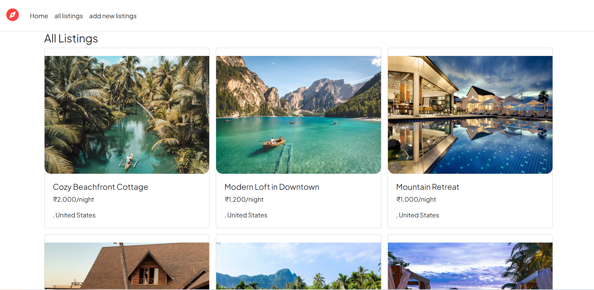

# Airbnb Clone

A full-stack Airbnb Clone web application built using **Node.js, Express.js, MongoDB, and EJS**.
The application allows users to view, create, edit, and delete property listings.

---

## 📸 Screenshots

### Listings Page


### Listing Details


### Add New Listing


### Edit Listing


---

## ✨ Features

- View all property listings
- View detailed information of a listing
- Create new listings
- Edit existing listings
- Delete listings
- Image support for properties
- Price displayed in INR
- Location and country information
- Responsive UI using Bootstrap

---

## 🛠 Tech Stack

- Node.js
- Express.js
- MongoDB
- Mongoose
- EJS
- Bootstrap
- HTML & CSS
- Git & GitHub

---

## 🚀 How to Run the Project

### Prerequisites
- Node.js installed
- MongoDB installed and running

### Steps

1. Clone the repository
```bash
git clone https://github.com/varsha-s-p/airbnb-clone.git
